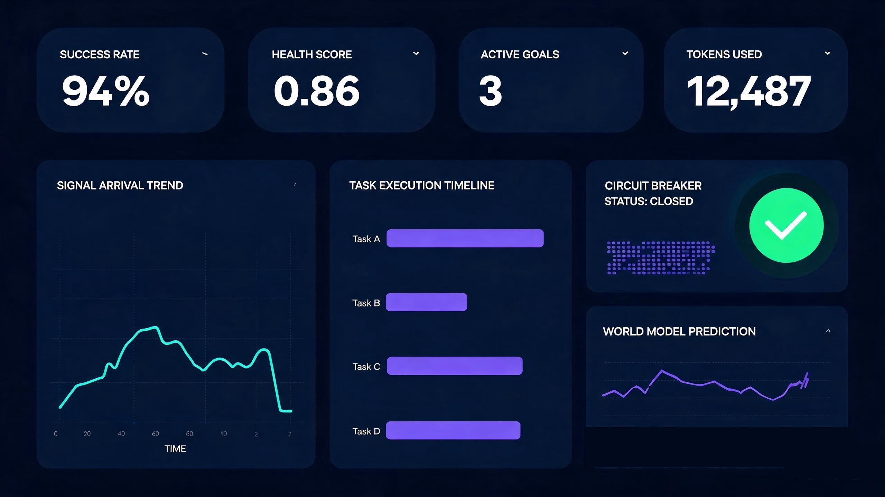
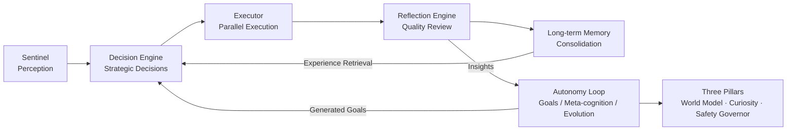

# dsh-autonomous-scheduler

[](./LICENSE)
[](./tsconfig.json)
[](#installation)
[](https://github.com/topics/dsh-plugin)

> **Proactive Intelligence scheduling plugin** — a multi-model collaborative scheduling system for the DeepSeek Harness (DSH) ecosystem: it perceives, decides, and evolves on its own.
>
> English | [中文](./README.md)



## What is Proactive Intelligence?

Traditional schedulers are **reactive**: they respond only when a signal arrives and idle otherwise. On top of the "perceive → decide → execute → reflect → consolidate" loop, this plugin adds an autonomy layer so the system:

- **When idle**, actively observes its own runtime state, discovers bottlenecks, and generates improvement goals
- **Facing unknown territory**, actively launches explorations, turning "unknown" into "experienced"
- **Anticipating future load**, actively predicts signal arrival trends and reserves capacity ahead of time
- **On anomalies**, actively trips circuit breakers, rate-limits, and degrades — instead of waiting to crash



## Core Features

### Proactive Perception
- Sentinel multi-source signal ingestion (webhook / filesystem watch / polling / manual injection)
- Aggregation window deduplication & merging, urgency-based ranking

### Autonomous Decision-Making
- Strategic decision engine: execute / defer / dismiss / ask-user
- Experience retrieval + DAG plan generation + multi-model parallel execution
- Decision caching and feedback loop

### Self-Reflection & Evolution
- Goal engine: generates goals from insights and decomposes them into subtasks
- Reflection engine: auto-retry / model switching when quality falls below threshold
- Meta-cognition engine: continuous KPI health monitoring with self-tuning
- Strategy evolution engine: genetic algorithm evolving optimal decision genes
- Long-term memory: task patterns, model profiles, and lessons persisted across sessions

### The Three Pillars of Proactive Intelligence
- **World Model** (`world-model.ts`): arrival rate statistics, hourly histograms, arrival prediction (with confidence intervals), trend detection, prediction calibration (MAE)
- **Curiosity Engine** (`curiosity-engine.ts`): knowledge gap scanning (unexplored / low-experience / high-failure), novelty scoring, health-adaptive exploration budget
- **Safety Governor** (`safety-governor.ts`): per-minute rate limiting, token/cost budgets, circuit breaker (consecutive failures → cooldown → half-open), confidence gating, kill switch, audit logging

### Engineering Infrastructure
- Raft consensus, distributed sync, hot reload, AES-256 encrypted storage
- Multi-tenancy, benchmark engine, real-time progress WebSocket, visual dashboard
- 13 registered tools, including `introspect` seven-dimension self-awareness report

## Autonomy Loop

Each heartbeat executes an 8-step orchestration:

1. Meta-cognition observation — collect KPIs, surface anomaly insights
2. World model forecasting — predict signal arrivals, capture rising trends
3. Insight aggregation — merge lessons from the reflection engine
4. Goal generation — auto-create improvement goals from insights and decompose subtasks
5. Subtask dispatch — inject into execution after safety governance review
6. Curiosity exploration — spare capacity spent on knowledge gap exploration
7. Strategy evolution — evolve decision strategies via genetic algorithm
8. Memory maintenance — experience distillation + forgetting curve

## Installation

Requirements: Node.js ≥ 18, pnpm.

```bash
git clone https://github.com/beijingwahw/dsh-autonomous-scheduler.git
cd dsh-autonomous-scheduler
pnpm install
pnpm build
```

## Configuration (Zero Manual Setup)

**Works out of the box — no manual model or key configuration required, and the plugin itself never holds an API Key.**

- The bundled [cordis.yml](./cordis.yml) already packages all domestic models (DeepSeek / Qwen / Zhipu GLM / Kimi / MiniMax / iFlytek Spark / Tencent Hunyuan / Baidu ERNIE / SenseTime SenseChat); load and run;
- At runtime the plugin obtains the configured LLM client from the ctx context, and DSH automatically injects the user-configured Key (Web UI or environment variables) into request headers;
- **Automatic key pickup**: the plugin also reads host-local keys and fills them into request headers by vendor, with priority host ctx injection → process environment variables (e.g. `DEEPSEEK_API_KEY` / `DASHSCOPE_API_KEY`, matched by model id prefix) → DSH local config files (`~/.dsh/config.json`, etc.); keys stay in memory only — never persisted or logged;
- For a single vendor only, use the per-vendor patches under `patches/domestic-models/`; regenerate with `pnpm generate:patches`.

All runtime options (sentinel / encryption / sync / consensus / hot reload / tenants) are likewise built into [cordis.yml](./cordis.yml) and need no changes.

## Tool Usage Example

Get the seven-dimension introspection report via `manage_autonomy`:

```jsonc
// Call: manage_autonomy { "action": "introspect" }
// Response (excerpted example):
{
  "loop":      { "running": true, "tickCount": 42 },
  "health":    { "score": 0.86 },
  "goals":     { "active": 3 },
  "exploration": { "totalExplorations": 5 },
  "governance":  { "circuitState": "closed" },
  "worldModel":  { "types": 4 },
  "evolution":   { "generation": 7 }
}
```

Other common operations:

- `manage_autonomy`: `start` / `stop` / `tick` / `kill-switch` / `revive` / `reset-circuit`
- `query_memory`: `world-model` / `curiosity` / `governance` / `patterns` / `lessons`, etc.

## Project Structure

```
src/
├── index.ts                  # Plugin entry & 10-step pipeline orchestration
├── sentinel.ts               # Signal perception
├── decision-engine.ts        # Strategic decision-making
├── executor.ts               # Plan generation & parallel execution
├── reflection-engine.ts      # Quality reflection
├── goal-engine.ts            # Goal engine
├── meta-cognition.ts         # Meta-cognition monitoring
├── strategy-evolution.ts     # Strategy evolution
├── world-model.ts            # World model (foreseeing)
├── curiosity-engine.ts       # Curiosity engine (intrinsic motivation)
├── safety-governor.ts        # Safety governor (boundaries)
├── autonomy-loop.ts          # Autonomy loop orchestration
├── memory/                   # Long-term memory & migration
├── consensus/                # Raft consensus
├── sync/                     # Distributed sync
├── hot-reload/               # Hot reload
├── security/                 # Crypto engine
├── tenant/                   # Multi-tenancy
├── benchmark/                # Benchmark engine
└── dashboard/                # Visual dashboard
```

## License

[MIT](./LICENSE)
