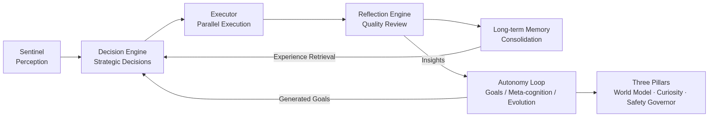

# dsh-proactive

[](./LICENSE)
[](./tsconfig.json)
[](#installation)
[](https://github.com/topics/dsh-plugin)

> **Proactive Intelligence scheduling plugin** — a multi-model collaborative scheduling system for the DeepSeek Harness (DSH) ecosystem: it perceives, decides, and evolves on its own.
>
> English | [中文](./README.md)

## What is Proactive Intelligence?

Traditional schedulers are **reactive**: they respond only when a signal arrives and idle otherwise. On top of the "perceive → decide → execute → reflect → consolidate" loop, this plugin adds an autonomy layer so the system:

- **When idle**, actively observes its own runtime state, discovers bottlenecks, and generates improvement goals
- **Facing unknown territory**, actively launches explorations, turning "unknown" into "experienced"
- **Anticipating future load**, actively predicts signal arrival trends and reserves capacity ahead of time
- **On anomalies**, actively trips circuit breakers, rate-limits, and degrades — instead of waiting to crash



## Core Features

### Proactive Perception
- Sentinel multi-source signal ingestion (webhook / filesystem watch / polling / manual injection)
- Aggregation window deduplication & merging, urgency-based ranking

### Autonomous Decision-Making
- Strategic decision engine: execute / defer / dismiss / ask-user
- Experience retrieval + DAG plan generation + multi-model parallel execution
- Decision caching and feedback loop

### Self-Reflection & Evolution
- Goal engine: generates goals from insights and decomposes them into subtasks
- Reflection engine: auto-retry / model switching when quality falls below threshold
- Meta-cognition engine: continuous KPI health monitoring with self-tuning
- Strategy evolution engine: genetic algorithm evolving optimal decision genes
- Long-term memory: task patterns, model profiles, and lessons persisted across sessions

### The Three Pillars of Proactive Intelligence
- **World Model** (`world-model.ts`): arrival rate statistics, hourly histograms, arrival prediction (with confidence intervals), trend detection, prediction calibration (MAE)
- **Curiosity Engine** (`curiosity-engine.ts`): knowledge gap scanning (unexplored / low-experience / high-failure), novelty scoring, health-adaptive exploration budget
- **Safety Governor** (`safety-governor.ts`): per-minute rate limiting, token/cost budgets, circuit breaker (consecutive failures → cooldown → half-open), confidence gating, kill switch, audit logging

### Engineering Infrastructure
- Raft consensus, distributed sync, hot reload, AES-256 encrypted storage
- Multi-tenancy, benchmark engine, real-time progress WebSocket, visual dashboard
- 13 registered tools, including `introspect` seven-dimension self-awareness report

## Autonomy Loop

Each heartbeat executes an 8-step orchestration:

1. Meta-cognition observation — collect KPIs, surface anomaly insights
2. World model forecasting — predict signal arrivals, capture rising trends
3. Insight aggregation — merge lessons from the reflection engine
4. Goal generation — auto-create improvement goals from insights and decompose subtasks
5. Subtask dispatch — inject into execution after safety governance review
6. Curiosity exploration — spare capacity spent on knowledge gap exploration
7. Strategy evolution — evolve decision strategies via genetic algorithm
8. Memory maintenance — experience distillation + forgetting curve

## Self-Serving Intelligence Loop (Gets Smarter with Use)

The plugin is a self-serving, self-improving agent. Its core is a "perceive → decide → execute → learn" loop, supported by three pillars.
The new architecture organizes components along a unidirectional data flow, mirroring the architecture diagram:

```
Memory → Optimizer → ModelScheduler / TaskExecutor → Reflector → Memory Update
```

- **Memory** (`memory/long-term-memory.ts`): records task patterns, model capability profiles, and decision feedback as evolution fuel
- **Reflection** (`reflector.ts` + `reflection-engine.ts`): reviews every task, settles success patterns, extracts failure lessons, and updates memory
- **Optimization** (`optimizer.ts`): based on the updated memory, produces recommended models and reusable plans for better scheduling and decisions

The three pillars' interface contracts live in [contracts.ts](./src/contracts.ts): `IMemoryStore` / `IReflector` / `IOptimizer`,
strictly implemented by `LongTermMemory` / `Reflector` / `Optimizer`; external integrators depend on the interfaces only.

**Memory persistence**: built on Node's built-in `node:sqlite` (zero dependencies) with a fully relational schema —
separate tables for `task_patterns` / `model_profiles` / `decision_feedback` (+ `distilled_strategies` / `meta`),
hot query fields (task_type / confidence / frequency / last_seen_at, etc.) promoted to typed, indexed columns so SQL
can query and aggregate directly; WAL mode, prepared-statement caching, and incremental primary-key UPSERT sync with
transactional crash consistency and full restoration after restart; both legacy JSON memory files and legacy blob
tables upgrade losslessly and automatically. When encryption is enabled or the host lacks `node:sqlite`, it falls
back to the JSON atomic-write backend (unified abstraction in `memory/backend.ts`).

**Database engineering**: PRAGMA hardening (WAL + `busy_timeout=5000` for multi-connection safety +
`synchronous=NORMAL`); a versioned migration framework (`schema_version` + MIGRATIONS registry, each step in its own
transaction, new migrations simply appended); maintenance APIs (`integrityCheck` / `dbStats` row·page·WAL·capability
statistics / `checkpoint` WAL merge / `vacuum` reclamation / `backup` hot backup via checkpoint+file copy /
`rawQuery` read-only SQL channel).

**Autonomous-learning retrieval enhancements** (SQLite landing trio):
1. **Hybrid retrieval**: FTS5 dual-tokenization tables (trigram substring-level Chinese matching + jieba-style
   token-level matching, with `setChineseTokenizer` as the injection seam for a real jieba pipeline) + sparse
   term-frequency vector cosine search (sqlite-vec seam reserved: auto-enabled when the host preinstalls the
   extension, zero-dependency fallback otherwise) + memory-graph association, merged via four-way recall
   (`optimizer.hybridSearch`)
2. **Custom data-structure serialization**: the memory network (co-occurrence edge weights) and topic tree are
   managed and searched in memory, serialized to `memory-graph.json`, and reloaded at startup
   (`memory/memory-graph.ts`), compensating SQLite's graph-structure weakness; the reflector updates the graph on
   successful settlement and the optimizer uses it for associative recall
3. **Anti-hallucination short indices**: before injecting into the LLM, long memory IDs are converted to `#1…`
   short indices (`memory/alias-map.ts`) and decoded back to full IDs from model output, reducing hallucination
   rate and token cost

Three critical pathways of the loop (missing any one degrades the system to a static one):

1. **Experience-driven model selection**: recommended model combinations from the optimizer actually participate in node assignment by node type (`Optimizer.lookupExperience → ModelScheduler.assignModel`), not merely as prompt hints
2. **Strategy feedback calibration**: the reflector writes back application success rates for distilled strategies (`Reflector.reflectOnOutcome → recordStrategyOutcome`) — effective strategies grow stronger with use, ineffective ones are naturally eliminated
3. **Experience fast path**: when the optimizer matches a high-confidence pattern (default ≥ 0.9, tunable via `memoryFastPathThreshold`), the best historical successful plan is recalled directly (`Optimizer.recallPlan`), skipping LLM re-planning — faster, more stable, and cheaper on tokens with every use

Three hedging mechanisms (safety valves against "learning the wrong things", none dispensable):

1. **Forgetting curve** (`memory.applyForgettingCurve`, driven by the autonomy loop's low-frequency maintenance): long-unused memories decay in confidence per an Ebbinghaus model until fully forgotten; decay is idempotent via `lastDecayAt`, so frequent maintenance calls never compound
2. **Confidence decay**: covers both task patterns and distilled strategies — successes add, failures subtract, and strategies long unapplied/unverified decay and are pruned, letting ineffective experience die out naturally
3. **Threshold self-calibration** (`reflection-engine.calibrateThreshold`, driven by the reflector after every execution): high quality distributions tighten the threshold toward excellence, low ones relax it to avoid futile retry storms; the task executor reads the dynamic threshold

Offline end-to-end verification (simulates 10 closed-loop rounds, verifying recommended-model adoption / strategy feedback write-back / fast-path hits / the three hedging mechanisms):

```bash
node scripts/verify-self-evolution.mjs
```

## Installation

Requirements: Node.js `^22.18.0 || >=24.11.0`, pnpm.

```bash
git clone https://github.com/beijingwahw/dsh-proactive.git
cd dsh-proactive
pnpm install
pnpm build
```

## Configuration (Zero Manual Setup)

**Works out of the box — no manual model or key configuration required, and the plugin itself never holds an API Key.**

- The bundled [cordis.yml](./cordis.yml) already packages all domestic models (DeepSeek / Qwen / Zhipu GLM / Kimi / MiniMax / iFlytek Spark / Tencent Hunyuan / Baidu ERNIE / SenseTime SenseChat); load and run;
- At runtime the plugin obtains the configured LLM client from the ctx context, and DSH automatically injects the user-configured Key (Web UI or environment variables) into request headers;
- **Automatic key pickup**: the plugin also reads host-local keys and fills them into request headers by vendor, with priority host ctx injection → process environment variables (e.g. `DEEPSEEK_API_KEY` / `DASHSCOPE_API_KEY`, matched by model id prefix) → DSH local config files (`~/.dsh/config.json`, etc., hot-reloaded on mtime change and re-probed periodically when absent); keys stay in memory only — never persisted or logged;
- **Multi-key failover**: when several candidate keys exist for a vendor, auth failures (401/403) or quota exhaustion (429) automatically rotate to the next candidate key, upgraded with **health-aware routing** — keys are selected by success/failure statistics, with a 1-minute cooldown for 429 and a 5-minute cooldown for 401/403, auto-recovering on success; users can reorder key usage via the `manage_keys` tool (persisted across restarts); startup logs report each model's key sources (never the key values), and runtime key health is inspectable via `query_memory keys`;
- For a single vendor only, use the per-vendor patches under `patches/domestic-models/`; regenerate with `pnpm generate:patches`.

All runtime options (sentinel / encryption / sync / consensus / hot reload / tenants) are likewise built into [cordis.yml](./cordis.yml) and need no changes.

## Tool Usage Example

Get the seven-dimension introspection report via `manage_autonomy`:

```jsonc
// Call: manage_autonomy { "action": "introspect" }
// Response (excerpted example):
{
  "loop":      { "running": true, "tickCount": 42 },
  "health":    { "score": 0.86 },
  "goals":     { "active": 3 },
  "exploration": { "totalExplorations": 5 },
  "governance":  { "circuitState": "closed" },
  "worldModel":  { "types": 4 },
  "evolution":   { "generation": 7 }
}
```

Other common operations:

- `manage_autonomy`: `start` / `stop` / `tick` / `kill-switch` / `revive` / `reset-circuit`
- `query_memory`: `world-model` / `curiosity` / `governance` / `patterns` / `lessons`, etc.

## DSH Plugin Spec Compliance

This plugin follows the DeepSeek Harness (cordis) plugin development spec, with the following spec-compliance improvements made without impacting performance:

- **Function plugin shape + static metadata**: the default export is an `apply(ctx, config)` function plugin carrying `name` / `Config` / `provide` static metadata for the registry and loaders;
- **Schemastery Config schema**: `Config` is a standard schema; on load, cordis `resolveConfig` validates types and fills defaults automatically (sentinel / encryption / sync / consensus / hot reload / tenants / autonomy sections). Function-typed injection fields (`nodeRunner` / `judge` / `llm.fetchImpl`, etc.) pass through as extra properties, unaffected by validation;
- **Official Tool registration path**: when the host loads `@deepseek-ai/dsh-tools` (the `ctx.tools` service), the 14 tools are bridged via duck-typing into the official ToolRegistry, joining the pre/around/post execution pipeline and the model-visible surface (parameters converted to the official JSON Schema subset); when the host does not provide it, the plugin silently degrades to the internal ToolRegistry + `ctx.provide('schedulerTools')`, without pulling in the full agent stack;
- **Dependency injection & service declaration**: services are exposed via `ctx.provide('scheduler' / 'schedulerTools')`, with TypeScript declaration merging (`declare module '@deepseek-ai/cordis'`) typing the `Context`;
- **Lifecycle cleanup**: all resources are cleaned up in reverse dependency order via `ctx.effect` on fiber unload (including official tool unregistration);
- **Publish manifest**: `package.json` declares `dsh.bundle.patch` pointing to the [cordis.yml](./cordis.yml) bundle config layer, with complete `exports` / `files` / `engines` / `keywords`, and a `prepare` script ensuring install-time build.

## Host Fusion Layer

Beyond spec compliance, the plugin fuses deeply into the host runtime via cordis cross-fiber events, elevating from a "passive plugin" to a **host-level cognitive & safety layer** (auto-activates when the host loads `@deepseek-ai/dsh-tools`, silently degrades otherwise):

- **Whole-host observability** (`tools/result`, emit): observes every host tool call outcome — each call feeds the world model's `observeArrival` to learn host behavior rhythms (enhanced foresight); tool failures inject a `host-tool-failure` signal into the sentinel, triggering the decision pipeline's self-healing; when the same tool fails consecutively past a threshold (default 3), it auto-escalates: a high-urgency signal plus a lesson persisted to the reflection engine;
- **Whole-host safety governance** (`tools/pre-execute`, waterfall): the scheduler's safety governor gains veto power over the host pipeline — when the kill switch is engaged it freezes all host tool calls (emergency stop escalates from "freezing itself" to "freezing the host"); when the scheduler's own failure spiral trips the circuit breaker it fail-closed rejects host actions; read-only gating (`checkGate`) that consumes no rate-limit/budget;
- **Safety design**: observation is fail-open (its own errors never break the host pipeline), governance is fail-closed (rejects only in explicit unsafe states); self-excludes the scheduler's own 14 bridged tools to avoid feedback loops; zero new dependencies (structural types + declaration merging).

Config section `hostFusion`: `enabled` / `observeToolResults` / `governToolCalls` / `failureEscalationThreshold` (defaults `true / true / true / 3`).

## Project Structure

```
src/
├── index.ts                  # Plugin entry & 10-step pipeline orchestration
├── sentinel.ts               # Signal perception
├── decision-engine.ts        # Strategic decision-making
├── types.ts                  # Shared type layer (plans / results / injection points / errors)
├── contracts.ts              # Three-pillar interface contracts (IMemoryStore / IReflector / IOptimizer)
├── model-scheduler.ts        # Model scheduling (original: capability × memory weighting × cost awareness)
├── task-executor.ts          # Task execution (original: DAG parallelism + quality reflection + cascade)
├── optimizer.ts              # Optimizer (experience retrieval + fast-path plan recall)
├── reflector.ts              # Reflector (review + memory update + strategy feedback + distillation)
├── reflection-engine.ts      # Quality reflection engine (threshold self-calibration / lesson extraction)
├── goal-engine.ts            # Goal engine
├── meta-cognition.ts         # Meta-cognition monitoring
├── strategy-evolution.ts     # Strategy evolution
├── world-model.ts            # World model (foreseeing)
├── curiosity-engine.ts       # Curiosity engine (intrinsic motivation)
├── safety-governor.ts        # Safety governor (boundaries)
├── autonomy-loop.ts          # Autonomy loop orchestration
├── host-fusion.ts            # Host fusion layer (whole-host observability + governance)
├── dsh-host.ts               # DSH host integration (LLM client / model catalog / key injection)
├── memory/                   # Long-term memory (SQLite/JSON dual backend), memory graph, alias map & migration
├── consensus/                # Raft consensus
├── sync/                     # Distributed sync
├── hot-reload/               # Hot reload
├── security/                 # Crypto engine
├── tenant/                   # Multi-tenancy
├── benchmark/                # Benchmark engine
└── dashboard/                # Visual dashboard
```

## License

[MIT](./LICENSE)
