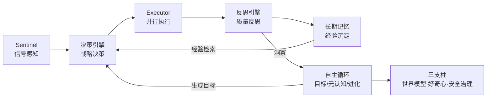

# dsh-autonomous-scheduler

[](./LICENSE)
[](./tsconfig.json)
[](#安装)
[](https://github.com/topics/dsh-plugin)

> **主动智能（Proactive Intelligence）调度插件** —— DeepSeek Harness（DSH）生态中的多模型协同调度系统：自主感知、自主决策、自主进化。
>
> [English](./README.en.md) | 中文


## 什么是主动智能？

传统调度系统是**被动的**：收到信号才响应，没有信号就空转。本插件在「感知 → 决策 → 执行 → 反思 → 沉淀」闭环之上叠加自主层，让系统：

- **没有任务时**，主动观察自身运行状态、发现瓶颈、生成改进目标
- **遇到未知领域**，主动发起探索，把"不知道"变成"有经验"
- **面对未来负载**，主动预测信号到达趋势，提前预留容量
- **出现异常时**，主动熔断、限流、降级，而不是等到崩溃



## 核心特性

### 主动感知
- Sentinel 多源信号接入（webhook / 文件监听 / 轮询 / 手动注入）
- 聚合窗口去重合并，紧急度智能排序

### 自主决策
- 战略决策引擎：execute / defer / dismiss / ask-user 四级决策
- 经验检索 + DAG 计划生成 + 多模型并行执行
- 决策缓存与反馈闭环

### 自我反思与进化
- 目标引擎：从洞察生成目标并分解子任务
- 质量反思引擎：低于阈值自动重试 / 切换模型
- 元认知引擎：持续监测 KPI 健康度并自调参
- 策略进化引擎：遗传算法演化最优决策基因
- 长期记忆：任务模式、模型画像、经验教训跨会话沉淀

### 主动智能三支柱
- **世界模型**（`world-model.ts`）：信号到达率统计、小时直方图、到达预测（含置信区间）、趋势检测、预测校准（MAE）
- **好奇心引擎**（`curiosity-engine.ts`）：知识盲区扫描（未探索 / 低经验 / 高失败率）、新颖度评分、健康度自适应探索预算
- **安全治理**（`safety-governor.ts`）：每分钟限流、token/成本预算、熔断器（连续失败→冷却→半开）、置信度门控、紧急停止开关、审计日志

### 工程基础设施
- Raft 共识、分布式同步、热更新、AES-256 加密存储
- 多租户隔离、基准测试引擎、实时进度 WebSocket、可视化 Dashboard
- 13 个 Tool 注册，支持 `introspect` 七维自省报告

## 自主循环（Autonomy Loop）

每个心跳执行 8 步编排：

1. 元认知观察 —— 采集 KPI，发现异常洞察
2. 世界模型预测 —— 预测信号到达，捕捉上升趋势
3. 洞察聚合 —— 合并反思引擎的经验教训
4. 目标生成 —— 从洞察自动生成改进目标并分解子任务
5. 子任务派发 —— 经安全治理审查后注入执行
6. 好奇探索 —— 剩余容量用于知识盲区探索
7. 策略进化 —— 遗传算法演化决策策略
8. 记忆维护 —— 经验蒸馏 + 遗忘曲线

## 安装

要求：Node.js ≥ 18、pnpm。

```bash
git clone https://github.com/beijingwahw/dsh-autonomous-scheduler.git
cd dsh-autonomous-scheduler
pnpm install
pnpm build
```

## 配置（零手动配置）

**开箱即用，无需手动配置任何模型或密钥，插件本身也不持有任何 API Key。**

- 随附的 [cordis.yml](./cordis.yml) 已封装全部国产模型（DeepSeek / 通义千问 / 智谱 / Kimi / MiniMax / 讯飞星火 / 腾讯混元 / 百度文心 / 商汤日日新），加载即用；
- 运行时插件经 ctx 上下文获取 DSH 已配置好的 LLM 客户端，DSH 自动把用户配置的 Key（Web UI 填写或环境变量配置）注入请求头；
- 若只需单一厂商，可改用 `patches/domestic-models/` 下按厂商拆分的 patch；重新生成：`pnpm generate:patches`。

完整运行配置项（哨兵 / 加密 / 同步 / 共识 / 热更新 / 租户）同样内置于 [cordis.yml](./cordis.yml)，无需改动。

## 工具调用示例

通过 `manage_autonomy` 获取七维自省报告：

```jsonc
// 调用：manage_autonomy { "action": "introspect" }
// 返回（示例，字段节选）：
{
  "loop":      { "running": true, "tickCount": 42 },
  "health":    { "score": 0.86 },
  "goals":     { "active": 3 },
  "exploration": { "totalExplorations": 5 },
  "governance":  { "circuitState": "closed" },
  "worldModel":  { "types": 4 },
  "evolution":   { "generation": 7 }
}
```

其他常用操作：

- `manage_autonomy`：`start` / `stop` / `tick` / `kill-switch` / `revive` / `reset-circuit`
- `query_memory`：`world-model` / `curiosity` / `governance` / `patterns` / `lessons` 等

## 项目结构

```
src/
├── index.ts                  # 插件入口与 10 步链路编排
├── sentinel.ts               # 信号感知
├── decision-engine.ts        # 战略决策
├── executor.ts               # 计划生成与并行执行
├── reflection-engine.ts      # 质量反思
├── goal-engine.ts            # 目标引擎
├── meta-cognition.ts         # 元认知监测
├── strategy-evolution.ts     # 策略进化
├── world-model.ts            # 世界模型（预见）
├── curiosity-engine.ts       # 好奇心引擎（内在动机）
├── safety-governor.ts        # 安全治理（边界）
├── autonomy-loop.ts          # 自主循环编排
├── memory/                   # 长期记忆与迁移
├── consensus/                # Raft 共识
├── sync/                     # 分布式同步
├── hot-reload/               # 热更新
├── security/                 # 加密引擎
├── tenant/                   # 多租户
├── benchmark/                # 基准测试
└── dashboard/                # 可视化面板
```

## 许可

[MIT](./LICENSE)
